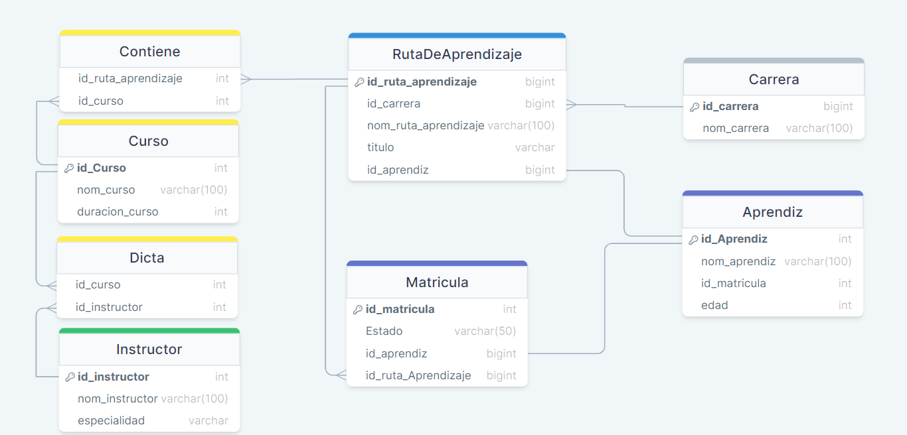

# PROYECTO-FINAL-SENA
***
#### MODELO ENTIDAD RELACION

***
#### MODELO RELACIONAL

***
#### Creacion base de datos:
~~~sql
    CREATE DATABASE proyecto_sena;
~~~
***
#### Ingreso a la base de datos:
~~~sql
    USE proyecto_sena;
~~~
***
#### Creacion de las tablas(SIN EL PRIMER PUNTO NI EL SEGUNDO PUNTO):
~~~sql
  CREATE TABLE Carrera (
      id_carrera BIGINT UNSIGNED NOT NULL AUTO_INCREMENT PRIMARY KEY,
      nom_carrera VARCHAR(100) NOT NULL
  );
  
  CREATE TABLE Curso (
      id_Curso INT UNSIGNED NOT NULL AUTO_INCREMENT PRIMARY KEY,
      nom_curso VARCHAR(100) NOT NULL
  );
  
  CREATE TABLE Instructor (
      id_instructor INT UNSIGNED NOT NULL AUTO_INCREMENT PRIMARY KEY,
      nom_instructor VARCHAR(100) NOT NULL,
      especialidad VARCHAR(255) NOT NULL
  );
  
  CREATE TABLE Aprendiz (
      id_Aprendiz BIGINT UNSIGNED NOT NULL AUTO_INCREMENT PRIMARY KEY,
      nom_aprendiz VARCHAR(100) NOT NULL
  );
  
  CREATE TABLE RutaDeAprendizaje (
      id_ruta_aprendizaje BIGINT UNSIGNED NOT NULL AUTO_INCREMENT PRIMARY KEY,
      id_carrera BIGINT UNSIGNED NOT NULL,
      nom_ruta_aprendizaje VARCHAR(100) NOT NULL,
      titulo VARCHAR(255) NOT NULL,
      id_aprendiz BIGINT UNSIGNED NOT NULL,
      FOREIGN KEY (id_carrera) REFERENCES Carrera(id_carrera),
      FOREIGN KEY (id_aprendiz) REFERENCES Aprendiz(id_Aprendiz)
  );
  
  CREATE TABLE Contiene (
      id_ruta_aprendizaje BIGINT UNSIGNED NOT NULL ,
      id_curso INT UNSIGNED NOT NULL,
      PRIMARY KEY (id_ruta_aprendizaje, id_curso),
      FOREIGN KEY (id_ruta_aprendizaje) REFERENCES RutaDeAprendizaje(id_ruta_aprendizaje),
      FOREIGN KEY (id_curso) REFERENCES Curso(id_Curso)
  );
  
  CREATE TABLE Dicta (
      id_curso INT UNSIGNED NOT NULL,
      id_instructor INT UNSIGNED NOT NULL,
      PRIMARY KEY (id_curso, id_instructor),
      FOREIGN KEY (id_curso) REFERENCES Curso(id_Curso),
      FOREIGN KEY (id_instructor) REFERENCES Instructor(id_instructor)
  );
  
  CREATE TABLE Estado_Matricula (
      id_matricula INT UNSIGNED NOT NULL AUTO_INCREMENT PRIMARY KEY,
      Estado VARCHAR(50) NOT NULL,
      id_aprendiz BIGINT UNSIGNED NOT NULL,
      id_ruta_aprendizaje BIGINT UNSIGNED NOT NULL,
      FOREIGN KEY (id_aprendiz, id_ruta_aprendizaje) REFERENCES RutaDeAprendizaje(id_aprendiz, id_ruta_aprendizaje)
  );
